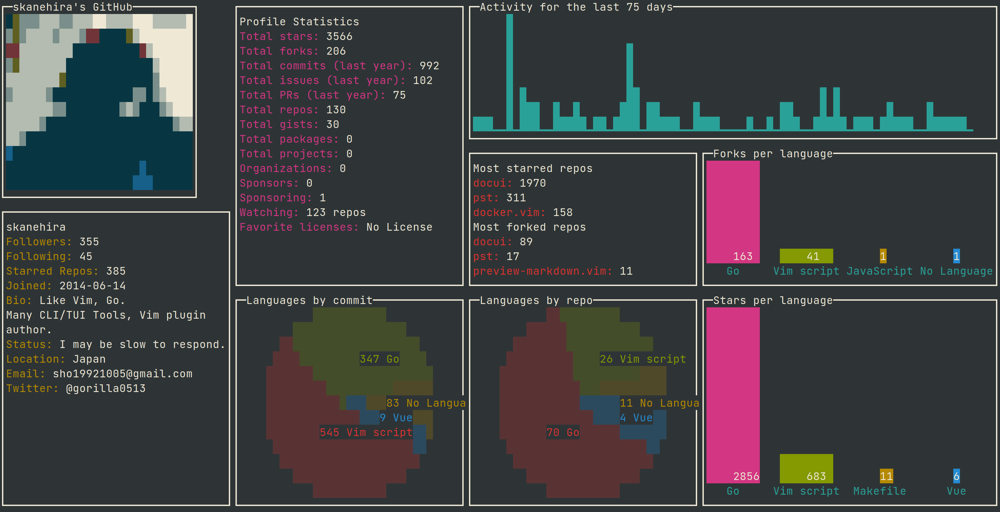

# 🐙🐱🖥️ octotui - GitHub stats in terminal
> Inspired by <a href="https://github.com/lowlighter/metrics">metrics</a> & <a href="https://github.com/vn7n24fzkq/github-profile-summary-cards">github-profile-summary-cards</a> & <a href="https://github.com/skanehira/github-tui">github-tui</a> 💖
<p align="center"> Data -  <a href="https://github.com/irevenko/octostats">irevenko/octostats</a> 
TUI - <a href="https://github.com/gizak/termui">termui</a>  </p> <br>


# Installation 🔨
```go get -u github.com/irevenko/octotui``` <br>

# Usage 🔬
```octotui <USER_OR_ORGANIZATION>``` <br>
Press ```Enter``` to invert image to monochrome color and then ```Tab``` to monochrome invert <br>
<GIF_CHANGING_AVATAR>

# TUI
- [x] Profile Image & user basic info/stats
- [x] Most starred, forked repos
- [x] Languages, by repo, commits, stars, forks
- [x] Activity sparkline
- [x] Search input (experimental)
- [x] Spinner (while fetching stats)
- [ ] Reconsider colors
- [ ] Tabs with another data like [metrics plugins](https://github.com/lowlighter/metrics#-metrics-)

# ToDo
- [ ] command to replace input component (cobra)
- [ ] token config
- [ ] fix octostats go.mod file
- [ ] docs

# Contributing 🤝
Contributions, issues and feature requests are welcome! 👍 <br>
Feel free to check [open issues](https://github.com/irevenko/octotui/issues).

# Quick Start 🚀
```git clone https://github.com/irevenko/octotui.git``` <br>
```cd octotui``` <br>
```go get -d ./...``` <br>
```go build``` <br>

# What I Learned 🧠
- Advanced termui

# License 📑 
(c) 2021 Ilya Revenko. [MIT License](https://tldrlegal.com/license/mit-license)