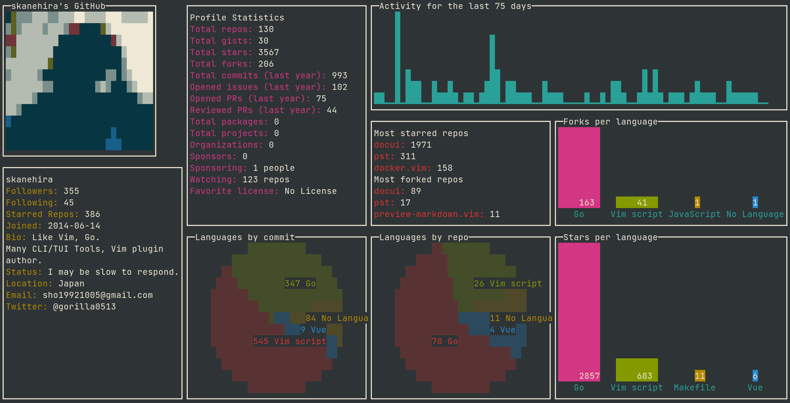

# 🐙🐱🖥️ octotui - GitHub stats in terminal
> Inspired by <a href="https://github.com/lowlighter/metrics">metrics</a> & <a href="https://github.com/vn7n24fzkq/github-profile-summary-cards">github-profile-summary-cards</a> & <a href="https://github.com/skanehira/github-tui">github-tui</a> 💖

 Data -  <a href="https://github.com/irevenko/octostats">irevenko/octostats</a> 
TUI - <a href="https://github.com/gizak/termui">termui</a>  
  

# TUI
- [x] Profile Image & user basic info/stats
- [x] Most starred, forked repos
- [x] Languages, by repo, commits, stars, forks
- [x] Activity sparkline
- [x] Search input (experimental)
- [x] Spinner (while fetching stats)
- [ ] Reconsider colors
- [ ] Tabs with another data like [metrics plugins](https://github.com/lowlighter/metrics#-metrics-)

# ToDo
- [ ] orgzanization support
- [ ] command to replace input component (cobra) (create branch with input-widget)
- [ ] token configuration
- [ ] fix octostats go.mod file
- [ ] docs